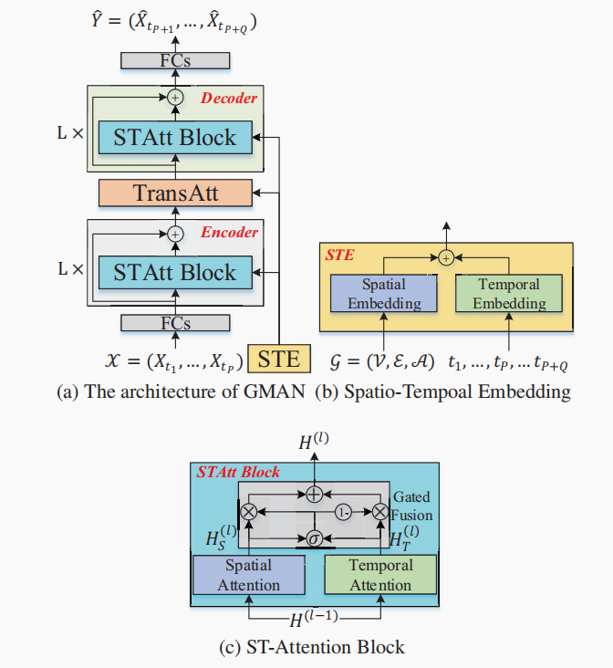

# 交通流量预测1.0

## 项目结构

```yaml
- data 数据集
    - dataset_name
        - SE_{dataset_name}.txt [num_vertex, dims=64]
        - TE_{dataset_name}.npz [seq_len,2]
        - {dataset_name}.npz [seq_len, num_vertex]
- config 配置文件
- ckpt 模型保存文件
- img
    - plot 训练过程train_loss和val_loss绘图
    - *.img markdown文件图像
- log 运行日志
- model 模型
- scripts 调试代码，数据预处理
- utils 数据集、功能函数定义
- trainer 模型训练、推理过程封装
- main.py 运行主代码
- checkpath.sh 补全项目目录结构
- train.sh 代码运行脚本，挂服务器后台，输出重定向至日志文件

```

## based on GMAN

key：Transformer, Gated Fusion, Spatial Embedding.

模型结构图如下：


## Dataset

### PEMS-BAY

```yaml
- SE_PeMS-BAY.txt (325, dims=64)
- TE_PeMS-BAY.npz (52116, 2)[day-of-week 0-7, time-of-day 0-288]
- PeMS-BAY.npz (52116, 325)
```

`(52116, 325)`

### PEMS04

```yaml
- SE_PeMS04.txt (307, dims=64)
- TE_PeMS04.npz (16992, 2)[day-of-week 0-7, time-of-day 0-288]
- PeMS04.npz (16992, 307)
```

`(16992, 307, 3)` [flow, occupy, speed]

2018年1月1日~2018年2月28日，采样间隔为5分钟

https://paperswithcode.com/task/traffic-prediction

The datasets are available at [Google Drive](https://drive.google.com/open?id=10FOTa6HXPqX8Pf5WRoRwcFnW9BrNZEIX) or [Baidu Yun](https://pan.baidu.com/s/14Yy9isAIZYdU__OYEQGa_g), provided by [DCRNN](https://github.com/liyaguang/DCRNN), and should be put into the corresponding data/ folder.

## Run

```bash
./train.sh
```

To be continue.
