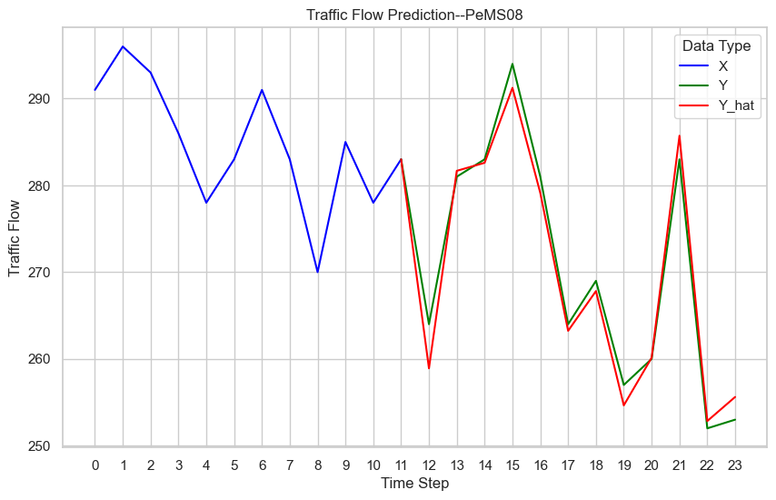
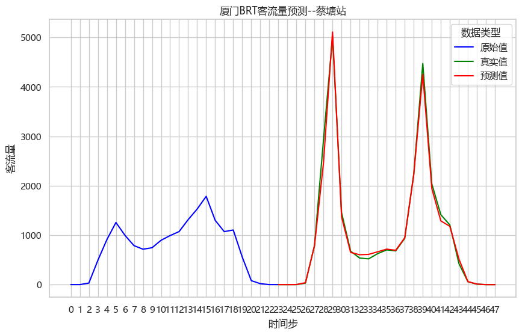
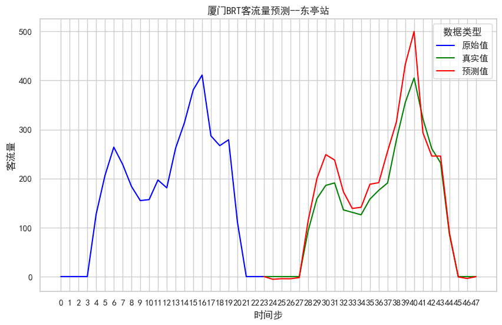

# Traffic Flow Forcasting

## Project Structure

```yaml
- data 数据集
    - dataset_name
        - SE_{dataset_name}.txt [num_vertex, dims=64]
        - TE_{dataset_name}.npz [seq_len,2]
        - {dataset_name}.npz [seq_len, num_vertex]
    - y_hat
        eval_plot模式下，保存测试集预测结果
        x       [num_samples, steps, num_vertex]
        y       [num_samples, steps, num_vertex]
        y_hat   [num_samples, steps, num_vertex]
- config 配置文件
- ckpt 模型保存文件
- img
    - plot 训练过程train_loss和val_loss绘图
    - vision 预测结果保存
    - *.img markdown文件图像
- log 运行日志，linux服务器上用重定向保存终端输出信息，代码中没有用log模块
- model 模型
- scripts
    - node2vec 生成SE文件，图节点向量表示
    - notebook
        调试代码，数据预处理，可视化
        - cost2adj_files.ipynb 将数据集中csv文件处理后生成adj files
        - meta-la_process.ipynb TE生成示例，weekofday[0,7),timeofday[0,T),T表示一天的时间步
- utils 数据集、功能函数定义
- trainer 模型训练、推理过程封装
- main.py 运行主代码
- checkpath.sh 补全项目目录结构
- train.sh 模型训练执行脚本，挂服务器后台，输出重定向至日志文件
- eval.sh 模型推理执行脚本
```

## based on GMAN

- 空间嵌入向量用node2vec方法生成
- 对于时间序列中每个时间步的编码方式：周几的编号`[0,7)` + 当天中所属时间步编号`[0,T)`
- 时间嵌入向量使用one-hot编码，最后嵌入向量拼接后使用MLP训练即可
- 整体参考Transformer结构
- Gated Fusion取自GRU，合并两路输出值，利用sigmoid函数生成0~1的权重系数，简要表达如下：

  $$
    X=\sigma*X_1+(1-\sigma)*X_2
  $$

`key`：Transformer, Gated Fusion, Spatial Embedding.

模型结构图如下：


## Dataset

### PEMS-BAY

```yaml
- SE_PeMS-BAY.txt (325, dims=64)
- TE_PeMS-BAY.npz (52116, 2)[day-of-week 0-7, time-of-day 0-288]
- PeMS-BAY.npz (52116, 325)
```

`(52116, 325)`

2017年1月1日~2017年6月30日，采样间隔为5分钟

### PEMS04

```yaml
- SE_PeMS04.txt (307, dims=64)
- TE_PeMS04.npz (16992, 2)[day-of-week 0-7, time-of-day 0-288]
- PeMS04.npz (16992, 307)
```

`(16992, 307, 3)` [flow, occupy, speed]

2018年1月1日~2018年2月28日，采样间隔为5分钟

### PEMS08

```yaml
- SE_PeMS08.txt (170, dims=64)
- TE_PeMS08.npz (17856, 2)[day-of-week 0-7, time-of-day 0-288]
- PeMS08.npz (17856, 170)
```

2016年7月1日~2016年8月31日，采样间隔为5分钟

### 数据集来源

[paperwithme](https://paperswithcode.com/task/traffic-prediction)

The datasets are available at [Google Drive](https://drive.google.com/open?id=10FOTa6HXPqX8Pf5WRoRwcFnW9BrNZEIX) or [Baidu Yun](https://pan.baidu.com/s/14Yy9isAIZYdU__OYEQGa_g), provided by [DCRNN](https://github.com/liyaguang/DCRNN), and should be put into the corresponding data/ folder.

## Run

### train

```bash
./train.sh [dataset_name]
```

### eval

```bash
./eval.sh [dataset_name]
```

### eval_plot

```bash
python main.py --cfg_file="./config/[datasetname]/config_server.json" --run_type="eval_plot"
```

该模式下保存了推理过程中的预测结果，包括`x`，`y`，`y_hat`，分别对应模型原始输入，真实值，预测值。

结果会保存在`data/y_hat/`目录下，接着执行`scripts\notebook\prediction_vision.ipynb`输出预测结果对照图。

其中PEMS08数据集预测结果如下图所示。



BRT为后来新增数据集（61天，每小时的客流数据），数据量较小，但是分布特征周期性显著，时间步设置为24（对应一天），根据历史一天的客流数据预测未来一天的客流数据，模型预测结果如下图所示。




